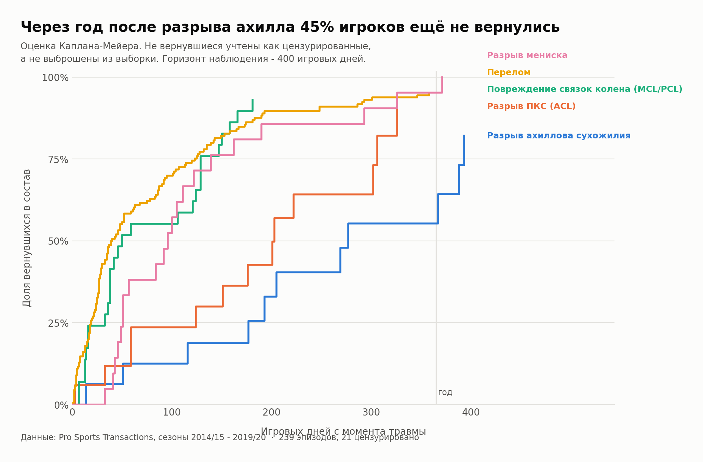
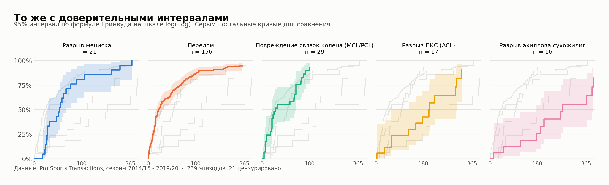
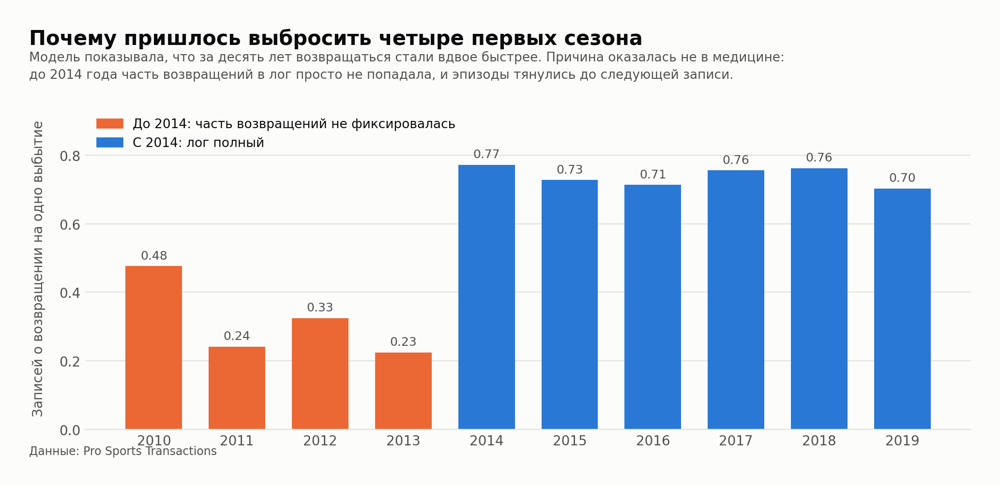
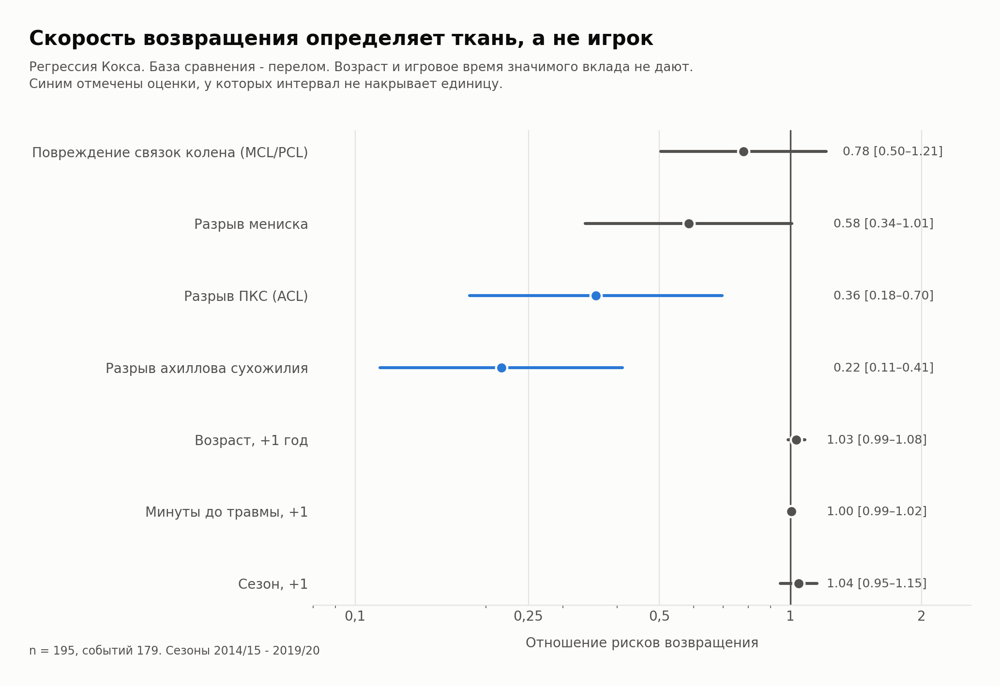

# Возвращение в состав после тяжёлой травмы в NBA

> Исправление, сентябрь 2026. Эпизоды в этой работе собраны только по журналу транзакций. Проверка по бокс-скорам в [return-to-play-football-vs-nba](https://github.com/PonomaryovPavel/return-to-play-football-vs-nba) подтвердила 23 из 54 эпизодов разрыва ахилла, ПКС и мениска: отчисления записывались как возвращения, пропущенные записи склеивали разные отсутствия, четыре «разрыва» разрывами не были. Цифрами ниже по этим трём травмам пользоваться нельзя, пересчёт — в новом репозитории.

Анализ выживаемости 239 эпизодов тяжёлых повреждений за сезоны 2014/15 – 2019/20.
Открытые данные, воспроизводимый расчёт на Python.

Через год после разрыва ахиллова сухожилия почти половина игроков ещё не вернулась на
площадку. У разрыва передней крестообразной связки медиана возвращения почти такая же,
но к году возвращаются девять из десяти. Разница между этими травмами не в сроке, а в
доле тех, кто не возвращается вовсе.



## Почему выживаемость, а не проценты

Часть игроков не вернулась вообще. Их исход не наблюдался, но это не пропуск в данных —
это «событие ещё не наступило к моменту, когда наблюдение кончилось». Такие наблюдения
называются цензурированными, и обращаться с ними нужно отдельно.

Выбросить их — завысить скорость возвращения. Засчитать как «никогда не вернулся» —
занизить. Оценка Каплана–Мейера учитывает каждого ровно столько времени, сколько он
находился под наблюдением, и поэтому свободна от обеих ошибок. Это стандартный
инструмент в исследованиях исходов лечения, и данные здесь ровно такой формы.

| Травма | n | Медиана, дней | К 90 дням | К 180 дням | К году | 95% интервал |
|---|---:|---:|---:|---:|---:|---|
| Разрыв ахиллова сухожилия | 16 | 277 | 12,5% | 25,5% | 55,3% | 32–81 |
| Разрыв ПКС (ACL) | 17 | 203 | 23,5% | 42,6% | 91,0% | 68–99 |
| Разрыв мениска | 21 | 96 | 42,9% | 81,0% | 95,2% | 80–100 |
| Повреждение связок колена (MCL/PCL) | 29 | 50 | 55,2% | 89,7% | 93,1% | 80–99 |
| Перелом | 156 | 40 | 67,3% | 86,2% | 95,2% | 91–98 |

Различие кривых неслучайно: log-rank даёт χ² = 27,3 при p = 1,8·10⁻⁵.



## Ошибка, которая едва не стала заголовком

Первый прогон модели Кокса на всех десяти сезонах дал красивый результат: каждый
следующий сезон возвращение происходило на 11% быстрее, накопленным итогом — в два с
половиной раза за десятилетие. Готовый заголовок про рывок спортивной медицины.

Прежде чем радоваться, я посмотрел на сырые медианы по периодам. Перелом в 2010–2012
годах давал медиану 175 игровых дней. Перелом не заживает полгода — значит дело не в
травмах, а в данных.



До 2014 года на каждое выбытие приходилось от 0,23 до 0,48 записи о возвращении, после —
стабильно около 0,73. И ровно в 2014 в логе появляется второй тип записи о возврате,
`returned to lineup`, которого раньше почти не было.

Часть возвращений просто не фиксировали. Эпизод оставался открытым до следующей записи по
этому игроку, а она могла случиться через полгода. Сроки в ранних сезонах завышены
искусственно, и сезонный коэффициент измерял полноту журнала, а не прогресс травматологии.

На чистом окне тот же коэффициент равен 1,04 с интервалом от 0,95 до 1,15 — эффект исчез
полностью. Это и был тест: настоящая закономерность не пропадает от смены окна.

Четыре первых сезона в работе не используются.

## Что определяет срок возвращения



Регрессия Кокса, база сравнения — перелом. Отношение рисков ниже единицы означает, что
игрок возвращается позже.

| Признак | HR | 95% интервал | p |
|---|---:|---|---:|
| Разрыв ахиллова сухожилия | 0,22 | 0,11–0,41 | <0,0001 |
| Разрыв ПКС (ACL) | 0,36 | 0,18–0,70 | 0,0026 |
| Разрыв мениска | 0,58 | 0,34–1,01 | 0,054 |
| Повреждение связок колена | 0,78 | 0,50–1,21 | 0,27 |
| Возраст, +1 год | 1,03 | 0,99–1,08 | 0,17 |
| Минуты до травмы, +1 | 1,00 | 0,99–1,02 | 0,56 |
| Сезон, +1 | 1,04 | 0,95–1,15 | 0,38 |

Ни возраст, ни игровое время до травмы значимого вклада не дают. Срок определяет
повреждённая ткань, а не тот, кому она принадлежит.

## Проверки

**Допущение пропорциональных рисков.** Наклоны кривых log(−log S) по log(времени):
перелом 0,81, связки колена 0,96, ПКС 0,74, ахилл 0,94, мениск 1,59. Мениск выбивается.
Отдельная проверка: эффект ахилла в первые 180 дней даёт HR 0,15, на всём горизонте —
0,30. Допущение выполняется приблизительно, поэтому отношения рисков читаются как
усреднённые по окну величины. Кривые Каплана–Мейера от этого не зависят — они не
предполагают ничего о форме.

**Устойчивость главной цифры.** Доля вернувшихся к году после разрыва ахилла: оценка
Каплана–Мейера 55,3% с интервалом Гринвуда 32–81, бутстрэп на 2000 повторах — 55,7% с
интервалом 28–81. Два независимых метода сходятся.

## Чего эта работа не говорит

- **Возвращение в состав — не восстановление.** Данные фиксируют день, когда игрок снова
  стал доступен тренеру, а не день, когда он снова стал собой.
- **Тяжесть определяется по свободному тексту.** В категории повреждений связок колена
  признак разрыва нашёлся лишь у 4 эпизодов из 45, остальное — растяжения. У ахилла,
  мениска и ПКС разметка чистая.
- **Выборки малы там, где интереснее всего.** Шестнадцать разрывов ахилла дают порядок
  величины, но не точное число, что и видно по ширине интервала.
- **Горизонт в 400 игровых дней выбран из здравого смысла**, а не выведен из данных.
  Вернувшиеся позже засчитаны как невернувшиеся.
- **Это не диагнозы.** Формулировки писали пресс-службы клубов, а не врачи.

## Файлы

| Файл | Что это |
|---|---|
| `analysis.ipynb` | весь разбор с выводом ячеек — главное здесь |
| `survival.py` | Каплан–Мейер, log-rank, регрессия Кокса, проверка допущений |
| `prepare.py` | сборка эпизодов из лога транзакций и разметка типов травм |
| `link.py` | стыковка имён между источниками, таблица псевдонимов |
| `analysis.py` | метрики игровой формы |
| `figures_surv.py` | построение графиков |

## Воспроизведение

```bash
git clone https://github.com/PonomaryovPavel/nba-return-after-injury.git
cd nba-return-after-injury
pip install -r requirements.txt
jupyter lab analysis.ipynb
```

## Данные

[Pro Sports Transactions](https://www.prosportstransactions.com/) через
[gboogy/nba-injury-data-scraper](https://github.com/gboogy/nba-injury-data-scraper),
статистика игроков — [Brescou/NBA-dataset-stats-player-team](https://github.com/Brescou/NBA-dataset-stats-player-team).

Предыдущая работа по этим же данным — сколько игровых дней стоит травма:
[nba-injury-cost](https://github.com/PonomaryovPavel/nba-injury-cost).
